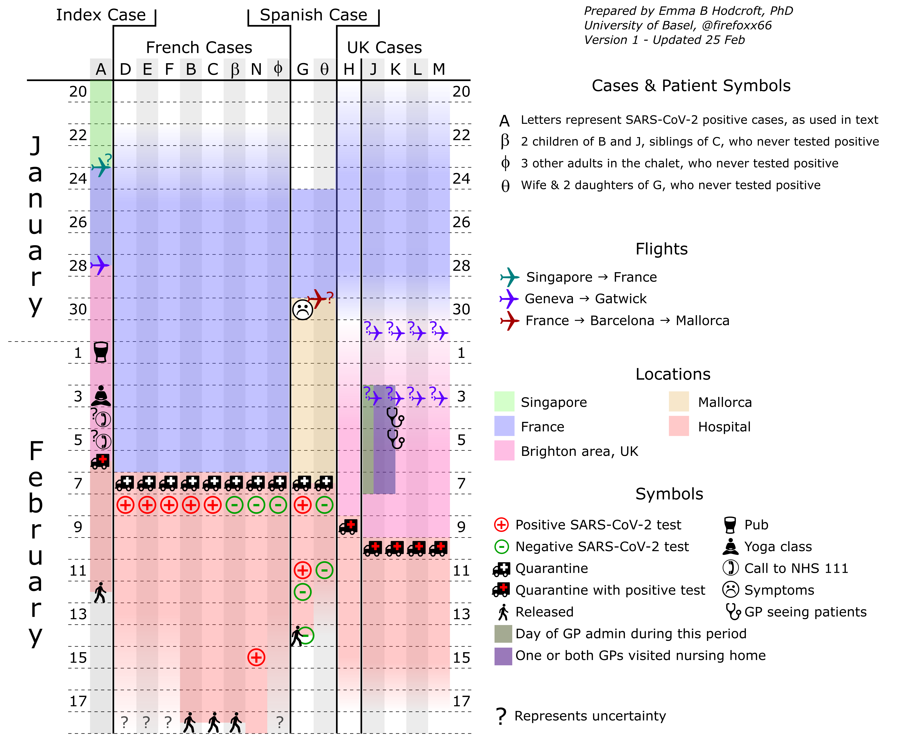

# British-COVID19-Cluster
Data relating to publication of a case report on the UK/France/Spain COVID-19 cluster in early 2020

This respository will hold images conveying information about the UK/France/Spain cluster of COVID-19 cases relating to the pre-print [title]().

If new information becomes available, the images will be updated. Older versions of the image can be found through Github's versioning.

## Figure 1

An overview of the 'UK/France' cluster shows the travel of the twenty-one people known to be involved, and the diagnosis dates of the 13 who eventually tested positivefor SARS-CoV-2. Only the dates of when focal case 'A' are in France are known definitely, and the overlap of 'A' with other cases, and the other cases with each other, is unknown.

## Figure 2

This detailed figure includes almost all information that is provided in the text, including travel and quarantine time, diagnoses and additional tests (if available), release date, and other important activities. Greek letters are used to represent multiple people who never tested positive for SARS-CoV-2. Questions marks show uncertainty about when or for whom an event occurred. Shading in the location colours conveys uncertainty about when individuals travelled, when they were present in a location, and by extension, when they overlapped with other individuals.
